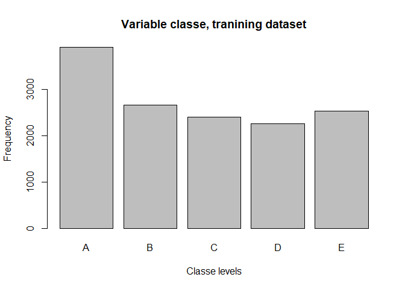

## Background

Using devices such as Jawbone Up, Nike FuelBand, and Fitbit it is now possible to collect a large amount of data about personal activity relatively inexpensively. These type of devices are part of the quantified self movement - a group of enthusiasts who take measurements about themselves regularly to improve their health, to find patterns in their behavior, or because they are tech geeks. One thing that people regularly do is quantify how much of a particular activity they do, but they rarely quantify how well they do it. In this project, the goal is to use data from accelerometers on the belt, forearm, arm, and dumbell of 6 participants. They were asked to perform barbell lifts correctly and incorrectly in 5 different ways. More information is available from the website here: http://web.archive.org/web/20161224072740/http:/groupware.les.inf.puc-rio.br/har.

The goal is to predict the manner in which they did the exercise. This is the "classe" variable in the training set. classe is a factor variable with 5 levels. 

Participants were asked to perform one set of 10 repetitions of the Unilateral Dumbbell Biceps Curl in 5 different fashions:
* A: exactly according to the specification
* B: throwing the elbows to the front
* C: lifting the dumbbell only halfway
* D: lowering the dumbbell only halfway
* E: throwing the hips to the front

## Procedure

1. Load, explore and clean the data
2. Split dataset into training (70%) an testing (30%) (cross-validation) 
3. Build models using different methods (like decision tree and random forest) and test predictive capabilities using testing dataset
4. Select model that maximizes accuracy and minimized error
5. Use selected model to predict classes of 20 observations

### Step 1: Load, explore and clean the data


```r
knitr::opts_chunk$set(echo = TRUE, results = FALSE)
data <- read.csv("C:/Google Drive/0Rdata/pml-training.csv", na.strings=c("NA","#DIV/0!", ""))

dim(data)
```

```
## [1] 19622   160
```

```r
class(data$classe)
```

```
## [1] "factor"
```

```r
table(data$classe)
```

```
## 
##    A    B    C    D    E 
## 5580 3797 3422 3216 3607
```
Delete columns with all missing values

```r
data <- data [,colSums(is.na(data)) == 0]
```
Remove irrelevant variables(columns 1 to 7): user_name, raw_timestamp_part_1, raw_timestamp_part_,2 cvtd_timestamp, new_window, and  num_window.


```r
data   <- data[,-c(1:7)]
```


```r
dim(data)
```

### Step 2. Split dataset into training (70%) an testing (30%)

```r
library(caret)
```

```
## Warning: package 'caret' was built under R version 3.5.1
```

```
## Loading required package: lattice
```

```
## Loading required package: ggplot2
```

```
## Warning: package 'ggplot2' was built under R version 3.5.1
```

```r
library(randomForest)
```

```
## Warning: package 'randomForest' was built under R version 3.5.1
```

```
## randomForest 4.6-14
```

```
## Type rfNews() to see new features/changes/bug fixes.
```

```
## 
## Attaching package: 'randomForest'
```

```
## The following object is masked from 'package:ggplot2':
## 
##     margin
```

```r
library(rpart) 
library(rattle)
```

```
## Warning: package 'rattle' was built under R version 3.5.1
```

```
## Rattle: A free graphical interface for data science with R.
## Version 5.2.0 Copyright (c) 2006-2018 Togaware Pty Ltd.
## Type 'rattle()' to shake, rattle, and roll your data.
```

```
## 
## Attaching package: 'rattle'
```

```
## The following object is masked from 'package:randomForest':
## 
##     importance
```

```r
set.seed(12345)
train <- createDataPartition(y=data$classe,p=.70,list=FALSE)
training <- data[train,]
testing <- data[-train,]

dim(training)
dim(testing)

plot(training$classe, col="gray", 
     main="Variable classe, tranining dataset", 
     xlab="Classe levels", ylab="Frequency")
```

<!-- -->
### Step 3. Build models
#### Model 1: Decision Tree

```r
model1 <- rpart(classe ~ ., data=training, method="class") # Model
prediction1 <- predict(model1, testing, type = "class") # Prediction
fancyRpartPlot(model1) # Plot
```

<!-- -->

```r
# Test results on testing data set
confusionMatrix(prediction1, testing$classe)

# Model 2: Random Forest
model2 <- randomForest(classe ~ ., data=training, method="class") # Model
prediction2 <- predict(model2, testing, type = "class") # Prediction

# Test results on testing data set
confusionMatrix(prediction2, testing$classe)
```
#### Model 2: Random Forest

```r
model2 <- randomForest(classe ~ ., data=training, method="class") # Model
prediction2 <- predict(model2, testing, type = "class") # Prediction

# Test results on testing data set
confusionMatrix(prediction2, testing$classe)
```
### Step 4. Model selection

Accuracy for Random Forest was 0.9925 (95% CI: (0.99, 0.9946)) compared to 0.722 (95% CI: (0.7104, 0.7334)) for Decision Tree. The Random Forest model is selected. The accuracy of the model is 0.9925 and expected error 0.0075, or 0.75%.

### Predict 20 cased of test data

```r
testdata <- read.csv("C:/Google Drive/0Rdata/pml-testing.csv")

dim(testdata)
names(testdata)
head(data)

testdata   <- testdata[,-c(1:7)]
dim(testdata)

predictfinal <- predict(model2, testdata, type="class")
predictfinal
```
